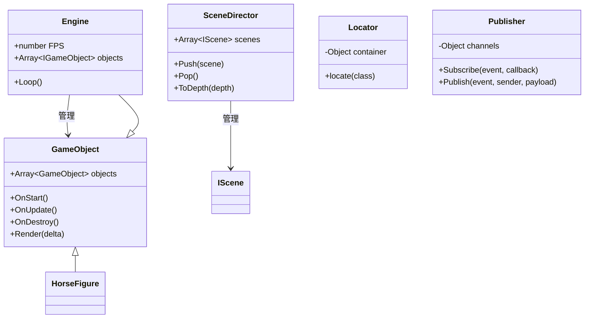

# [DSN-02] 詳細設計書 (Low-Level Design) - horse-racing-game-js

本ドキュメントは、バニラJavaScriptで構築された競馬ボードゲーム「`horse-racing-game-js`」の技術的な詳細設計を記述した開発者向けのドキュメントです。各モジュールの責務、クラス構造、イベントフローなどを詳細に解説します。

---

## 1. 全体クラス構成とデザインパターン

本システムは、フレームワークに頼らずに整理されたアーキテクチャを実現するため、いくつかの確立されたデザインパターンを採用しています。

* **Service Locator パターン (`Locator.js`)**:
  クラスインスタンスの生成と格納を一元管理するシングルトンコンテナです。循環参照を防ぎ、依存関係の注入（DI）を簡易的に実現します。
* **Observer パターン (`publisher.js`)**:
  `Publisher` クラスにより、ゲーム全体で Pub/Sub メッセージングを実現します。描画レイヤー（View）とゲームロジック（Controller/Model）間の結合度を大幅に下げ、イベント駆動型アーキテクチャを構成します。

---

## 2. コアサブシステム設計

### 2.1 メインゲームループ (`engine.js`, `main.js`)
* **固定タイムステップ更新と可変レンダリング**:
  `Engine` は `requestAnimationFrame` を用いて動作します。物理シミュレーションやゲーム状態の更新 (`OnUpdate`) は、遅延の有無にかかわらず一定時間ピッチで実行されます。描画処理 (`Render`) は利用可能な最大FPSで実行され、更新ピッチとのズレ（`delta`：0〜1の割合）を受け取り、描画側での線形補間（イージングなど）を可能にします。
* **FPSカウンター**:
  `FPS` クラスが毎秒のループ実行回数を計測し、`FPSLayer` にてUIにFPS情報を描画します。

### 2.2 イベントシステム (`event.js`, `events.js`)
* **DOM Level 2準拠イベント処理**:
  `ExEvent`, `ExEventTarget`, `ExEventListener` を独自実装。`dispatchEvent` や `addEventListener` を用いた、ブラウザ標準に近いバブリング/キャプチャに対応したイベント管理です。イベントの探索アルゴリズムは O(1) に最適化されています（詳細は [ADR-02](adr/ADR-02-custom-event-system.md) 参照）。

### 2.3 ルーティングとシーン遷移 (`scene.js`, `router.js`, `main.js`)
* **URLと履歴の連動**:
  `CustomSceneDirector` が `window.history.pushState` および `window.location.hash` をフックします。
  * `Title` ⇔ `#Title`
  * `Race` ⇔ `#Race`
  * `Result` ⇔ `#Result`
  ブラウザの「戻る」「進む」キーの操作によって `popstate` イベントが発生すると、URLに応じたシーンが自動的に再マウントされ、ページリロードなしに遷移状態を完全修復します。

---

## 3. レンダリング & テンプレートエンジン (`template.js`, `templates.js`, `layers/`)

* **Tornado Template (JSポート)**:
  Pythonの「Tornado Web Server」のテンプレートエンジンをJavaScriptに移植。HTML文字列内の ``, ``, ``, `{{ variable }}` を正規表現と動的関数生成（`new Function`）によって解釈し、高速にDOMフラグメントを生成します（詳細は [ADR-03](adr/ADR-03-tornado-template-engine-js-port.md) 参照）。
* **描画パイプライン (`RenderLayers`)**:
  各シーン（`GameScene`）は、複数のレイヤー（`ILayer` インターフェースを実装したクラス）で構成されます。
  1. **シーンマウント**: シーンが開始すると、指定された複数のレイヤーインスタンスが生成される。
  2. **描画コマンド構築**: レイヤーの `Render()` は `DocumentFragment` を返し、`Game.RenderCommandExecuter` に描画コマンドとしてエンキューされる。
  3. **画面描画**: `OnRender` イベント時に `RenderCommandExecuter.ExecuteAll()` が走り、最小限の回数でDOMを一括挿入（バッチ描画）します。

---

## 4. データ設計とモデル・検証システム (`entities.js`, `checker.js`, `repository.js`)

* **CSVスタブと動的キャスト**:
  `StubLoader` にハードコードされた二次元配列データ（CSVスキーマ）を、`Model` クラスが読み込みます。列名と型定義（`int`, `string`）に従い、キャスト処理を施した上でモデルプロパティとして動的バインドします。
* **リレーションチェッカー (`RelationshipChecker`)**:
  例えば `PlayCard.detail_id` が `StepCard.id` または `RankCard.id` と正しく関連付けられているかなど、定義された外部キー制約のような条件（`Equal` 等）をロード時に自己スキャンし、データの不整合を開発者コンソールへエラー出力します。
* **リポジトリパターン (`Repository`)**:
  データベースライクな `Store(id, entity)`, `Find(id)`, `All()` メソッドを提供し、エンティティのキャッシュとクエリシステムを抽象化します。

---

## 5. ゲーム内エンティティ & カードルール定義

* **レーストラック構造**:
  * `Race`：ゲームボード全体の管理。`len` でゴールラインの位置を規定。
  * `Racetrack`：複数の `Lane` を格納するトラック。
  * `Lane`：出走馬の位置 `position` を保持。`position > len` でゴールと判定。
* **カードの効果ロジック (`ICard`, `ICardEffect`)**:
  すべてのカードは `Play(race)` を実行すると、対応する `ICardEffect` インスタンスを返します。
  * **StepCardEffect**: 特定のレーン（馬）に対し、`position += step` を加算。
  * **RankCard (順位カード)**: `race.Ranks()` から現在の順位マップを取得。同順位が複数いる（同着）場合は効果なし。単独順位の馬に対してのみ `StepCardEffect` を適用。
  * **DashCard (ダッシュカード)**:
    * **Boost**: 1位のポジションと2位のポジションの差分を2倍にしたステップ数、1位の馬を進める。
    * **CatchUp**: 2位の馬を1位の馬の1歩後ろ（`first.position - 1`）まで進める。

---

## 6. コマンドパターンとUndo設計 (`command.js`, `main.js`)

* **コマンドスタックの活用**:
  カードのプレイ操作は `PlayCardCommand` としてカプセル化されます。
  * `Execute()`: 内部で `cardEffect.Apply()` を呼び出し、馬を進める。
  * `Undo()`: 内部で `cardEffect.UnApply()` を呼び出し、加算した歩数分引き算して馬を後退させる。
* **シミュレーションの一貫性**:
  `CommandExecuter` はプレイされたコマンドを配列（スタック）にプッシュし、履歴ポインタ `position_` で管理します。「一手戻す」際はスタックからポップして `Undo()` を呼び出すだけで、ゲームボード全体の座標整合性を保ったまま逆再生が可能です。
