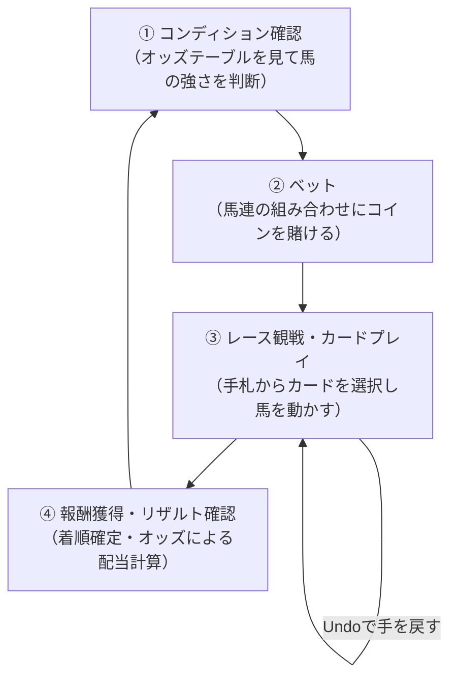
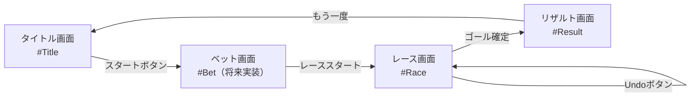

# [GDD-01] ゲームデザインドキュメント (Game Design Document) - horse-racing-game-js

本ドキュメントは、ブラウザベースの競馬ボードゲーム「`horse-racing-game-js`」のゲームとしてのビジョン、コアバリュー、ゲームプレイループ、数学的モデル、アート・オーディオの方向性、UI/UXの原則を定義した「羅針盤」です。「なぜこのゲームが面白いのか」「プレイヤーにどのような体験を提供するのか」を明文化することで、実装上の設計判断ブレを防ぎます。

---

## 1. ゲームビジョンとコアバリュー (Vision & Core Value)

### 1.1 ビジョンステートメント

> **「カードと賭けで駆け引きする、ブラウザで完結する戦略競馬体験」**

本ゲームは、アナログボードゲームの持つ「読み合いと確率の緊張感」をデジタル化し、インストール不要・ログイン不要のブラウザ上で瞬時に楽しめるものを提供します。

### 1.2 コアバリュー

| バリュー | 説明 |
| :--- | :--- |
| **即時性** | ブラウザを開けば30秒以内にゲームが開始できる。インストール・ログイン不要。 |
| **戦略性** | 乱数だけで勝敗が決まらず、手札の選択・ベット判断・Undoの活用が戦局に影響する。 |
| **透明性** | シード指定乱数（Xorshift）により、同じシードで常に同じゲーム展開が再現可能。フェアな環境。 |
| **軽量性** | Vanilla JSのみで構築し、150KB未満の超軽量動作。低速回線・古い端末でも快適にプレイできる。 |

---

## 2. コアゲームプレイループ (Core Gameplay Loop)

プレイヤーが繰り返し体験するゲームプレイの基本単位を以下の4ステップで定義します。



### 2.1 各フェーズの設計意図

| フェーズ | 設計意図 | 提供する感情 |
| :--- | :--- | :--- |
| **① コンディション確認** | オッズテーブルにより情報の非対称性が生まれ、読み合いが発生する | 期待・考察 |
| **② ベット** | 損失回避バイアスと高配当の魅力の間で決断を促す | 緊張・高揚 |
| **③ レース観戦** | カード選択という能動的な介入により「運ゲー感」を払拭する | 集中・達成感 |
| **④ 報酬獲得** | 的中時の大きなリターンと外れた時の悔しさによるリプレイ欲求 | 興奮・悔しさ |

---

## 3. 勝敗判定の数学的モデル (Mathematical Model)

### 3.1 オッズ設計思想

本ゲームは1着・2着の順不同組み合わせ「**馬連 (Quinella)**」を採用します。オッズはゲームバランスを考慮した固定オッズ方式です。

全10通りの組み合わせのオッズ総和から算出される期待収益率（RTP: Return to Player）を均一化することで、特定の組み合わせへの偏りによる「最適解の自明化」を防いでいます。

| 組み合わせ | オッズ | 設計意図 |
| :---: | :---: | :--- |
| **1 - 2** | **5倍** | 最強コンビへの低リスク・低リターンのアンカー |
| **4 - 5** | **20倍** | 格下コンビの高リスク・高リターン枠。逆転劇への期待感を演出 |
| （中間各組） | 7〜17倍 | リスク・リターンの多様なグラデーションを形成 |

### 3.2 カード効果の数値設計

カードの移動量はゲームバランスのコアパラメータです。設計変更時は本節を必ず更新してください。

**ステップカード (Step Card)** — 総計45枚

| モンスター | 移動量 | 設計意図 |
| :--- | :--- | :--- |
| ドラゴン (Red/1) | +5, +9, +10 (各3枚) | 最大移動力。1枚で局面を変えうる「エース枠」 |
| デーモン (Orange/2) | +5, +6, +8 (各3枚) | 安定の中高移動力 |
| ドラキー (Green/3) | +4, +5, +7 (各3枚) | 中移動力 |
| ゴーレム (Blue/4) | +4, +5, +6 (各3枚) | 低〜中移動力 |
| ゴースト (Purple/5) | +3, +4, +5 (各3枚) | 最小移動力。高オッズ馬として配当を高める役割 |

**ダッシュカード (Dash Card)** — 2枚（各1枚）の特殊設計

| カード | 計算式 | 条件 | 設計意図 |
| :--- | :--- | :--- | :--- |
| ブースト (Boost) | $(1位座標 - 2位座標) \times 2$ | 1位・2位が単独 | トップ馬の逃げ切りを強化し、高リスクな単勝ベットを報いる |
| キャッチアップ (Catch Up) | $(1位座標 - 1) - 2位座標$ | 1位・2位が単独 | 差を一瞬で詰める逆転演出。観戦の緊張感を最大化する |

### 3.3 ゲームバランスKPI

以下の指標を定期的に `make test` + デバッグオートプレイで計測し、バランス維持の判断材料とします。

| KPI | 目標値 | 計測方法 |
| :--- | :--- | :--- |
| 平均ゲーム時間（カードプレイ回数） | 25〜40ターン | オートプレイシミュレーション |
| 最下位 (5位) 馬の最終着順分布 | 4〜5着に70%以上 | オートプレイ統計 |
| ダッシュカード（キャッチアップ）発動率 | ゲームあたり50%以上 | オートプレイログ |

---

## 4. アート・オーディオの方向性 (Art & Audio Direction)

### 4.1 ビジュアルコンセプト

**「ファンタジー競馬場」** ——「モンスターフィギュアが走る幻想的なレーストラック」を視覚的テーマとします。

| 要素 | 方針 |
| :--- | :--- |
| **カラーパレット** | 各馬に固有のテーマカラー（Red/Orange/Green/Blue/Purple）を割り当て。HSLによる彩度管理でブランドカラーを統一 |
| **タイポグラフィ** | Google Fonts `Outfit`（数字・ラベル）, `Inter`（UI全般）, `Noto Serif JP`（日本語）の3フォント体制 |
| **アニメーション** | `requestAnimationFrame` による60FPS描画。馬の移動はイージング補間でスムーズに表現 |
| **デザインフィロソフィ** | 「自己記述的UI」——マニュアルなしで機能が直感的に理解できるアイコン・レイアウト |

### 4.2 オーディオ方針（将来ロードマップ）

現時点では音声機能は未実装です。将来実装する際は以下の方針に従うこと（[REQ-02-feature_list.md](REQ-02-feature_list.md) の FEAT として追加し管理）。

- **SE（効果音）**: WAV/OGG形式、最大44.1kHz/16bit。ファイルサイズは1音源あたり100KB以内。
- **BGM**: Loopable OGG形式。ゲーム本体サイズへの影響を避けるため、遅延読み込み（lazy load）とする。

---

## 5. UI/UXデザイン原則 (UI/UX Principles)

### 5.1 基本原則

本ゲームのUI/UX設計は以下の3原則に基づきます。

1. **直感性（Intuitiveness）**: プレイヤーはマニュアルを参照せずに操作できること。
2. **フィードバック性（Feedback）**: 全ての操作は即座に視覚的フィードバック（位置変化・ハイライト）を返すこと。
3. **回復性（Recoverability）**: 誤操作はUndo機能で回復可能とし、プレイヤーに「安心して試せる」環境を提供すること。

### 5.2 画面遷移設計



### 5.3 画面構成要素と優先度

| 画面 | 必須要素 | 将来実装 |
| :--- | :--- | :--- |
| タイトル | ゲームタイトル、スタートボタン、シード値表示（デバッグ） | サウンドON/OFF |
| レース | レーストラック、手札カード、FPS表示、Undoボタン、デバッグメニュー | コインベットUI |
| リザルト | 着順表示、配当額計算結果、リスタートボタン | リプレイ再生 |

---

## 6. 実装優先順位と設計制約 (Implementation Priorities & Constraints)

### 6.1 JavaScript特有の技術制約

本ゲームはVanilla JS + Google Closure Compilerで構築されており、以下の制約を設計判断の前提とします。

| 制約 | 詳細 | 対応方針 |
| :--- | :--- | :--- |
| **型安全性** | Closure Compilerの型チェック（`--jscomp_error=checkTypes`）が必須 | 全関数にJSDocアノテーションを付与 |
| **DOMアクセス** | `innerHTML`使用禁止（XSS防止）。`DocumentFragment`による一括DOM操作 | テンプレートエンジン経由の描画に統一 |
| **ファイルサイズ** | コンパイル後150KB以下を維持 | 外部ライブラリ導入は原則禁止（ADR参照） |
| **非同期処理** | メインゲームループは`requestAnimationFrame`で制御。Promiseの使用は慎重に | 非同期処理は描画ループ外に隔離 |

### 6.2 「エンジン構築の罠」への対策

開発者がゲームエンジン自体の構築に過度な時間を費やすことを防ぐため、以下の優先順位を厳守します。

```
優先度 HIGH  : ゲームロジック・ルール・バランス
優先度 MEDIUM: UI/UX・フィードバック演出
優先度 LOW   : エンジン機能の追加・描画システムの最適化（現状で十分な場合は着手しない）
```

> [!IMPORTANT]
> 新機能のADR登録なしにエンジン基盤（`engine.js`, `template.js`, `publisher.js` 等）へ大規模変更を加えることは禁止します。変更前に必ず [MNG-02-development_process.md](MNG-02-development_process.md) セクション 2.3 のADRプロセスに従ってください。

---

## 7. 関連ドキュメント

| ドキュメント | 関連内容 |
| :--- | :--- |
| [REQ-01-user_requirements.md](REQ-01-user_requirements.md) | ターゲットユーザーと主要ユースケース |
| [REQ-03-system_requirements.md](REQ-03-system_requirements.md) | カード効果・オッズの詳細数値仕様 |
| [DSN-01-high_level_design.md](DSN-01-high_level_design.md) | システム全体アーキテクチャ |
| [USR-01-user_manual.md](USR-01-user_manual.md) | プレイヤー向けルールブック |
| [ADR-01-vanilla-javascript-architecture.md](adr/ADR-01-vanilla-javascript-architecture.md) | Vanilla JS採用の技術的根拠 |
