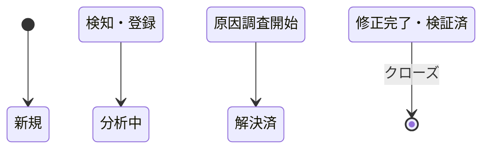

# [MNG-03] 問題管理定義書 (Problem & Issue Management) - horse-racing-game-js

本ドキュメントは、「`horse-racing-game-js`」プロジェクトにおける問題・課題管理の方針、プロセス、および現在検出されている不具合・未実装機能の進捗管理を行うための台帳です。

---

## 1. 問題管理プロセスとライフサイクル (Lifecycle)

バグや機能改善要求などの「問題」は、検知から解決まで以下のライフサイクルに従ってステータスを追跡します。

### 1.1 優先度（Severity）の判定基準
影響度に基づき、問題を以下の3つに分類して対応を行います。
* **High (高)**: ゲームの進行が完全に停止する、またはコアロジックが誤った計算をするなど、プレイ不能になる不具合。
* **Medium (中)**: 主要機能（ベット、データ検証など）の未実装、または仕様の不整合。
* **Low (低)**: 表示のガタつき、コーディング規約の不統一など、代替策が存在する、あるいはゲームプレイ自体への影響が軽微なもの。

---

## 2. 課題・バグ管理台帳 (Issue Ledger)

現在プロジェクトで追跡している課題およびバグの一覧です。

### [ISSUE-01] プレイカード使い切り時のスタック問題 (Severity: High)
* **ステータス**: 新規 (New)
* **現象**: プレイカード（山札60枚）をすべて使い切っても、2位の馬がゴールインしていない場合、ゲームが未完了のままスタックしてしまう。
* **原因の仮説**:
  * `RaceDirector.prototype.OnUpdate` のゴール判定ロジックが、同時にゴールした場合や `Undo` を実行した際、正常に `goals_` 配列を処理できていない。
  * 山札全体のバランスが、コース全長70マスに対して不足する場合がある（レベルデザインのミスマッチ）。
* **恒久対策**: カードを使い切った段階で最終座標順に順位を強制確定する、またはゴール判定条件のロジック堅牢化。

### [ISSUE-02] ゲームシステム（対戦・ベット）の本実装 (Severity: Medium)
* **ステータス**: 分析中 (Analyzing)
* **内容**: 現在はデバッグ自動プレイがメインとなっており、ボードゲームとしての「対戦プレイ」の枠組みが未実装。
  * **プレイヤー管理**: 人数の決定、手札配布、ターン処理。
  * **ベットシステム**: レース開始前のベットUIの構築（ロジックは `Bet` クラスに仮実装されているが、画面と未連携）。
  * **リザルトポイント計算**: レース終了時の着順オッズに基づく最終コイン計算。

### [ISSUE-03] マスターデータの値バリデータ (ValueChecker) の未実装 (Severity: Medium)
* **ステータス**: 新規 (New)
* **内容**: リレーションのチェック (`RelationshipChecker`) は実装されているが、値自体の範囲や正当性（例: カードの進むマス数が負の値でないか等）をバリデーションする `ValueChecker` が TODO のまま未実装。

### [ISSUE-04] レンダラーとモデルの密結合 (Severity: Low)
* **ステータス**: 解決済 (Resolved)
* **内容**: `RacetrackLayer` や `OddsTableLayer` などの描画レイヤーが、ゲームの内部オブジェクトやディレクターと非常に強く結合している。モデルの変更が描画側へ直接影響するため、Pub/Sub イベントを経由した疎結合データ通信への移行が望まれる。
* **対応内容 (2026.6.14)**: 新しいPub/Subイベント `Events.Race.OnChanged` を定義し、`RaceDirector` 側の状態変更時にモデルデータ（`racetrack`, `oddstable`）をペイロードに載せてパブリッシュするように変更。`RacetrackLayer` と `OddsTableLayer` はこれを購読してペイロードのみで描画を行うよう修正し、密結合を完全に解消しました。

### [ISSUE-05] コーディング規約の混在 (Severity: Low)
* **ステータス**: 新規 (New)
* **内容**: キャメルケースとスネークケースの混在、オブジェクト指向の継承方法に一貫性がない（`GameObject` の継承スタイルなど）ため、リファクタリングによる整理が必要。

### [ISSUE-06] エンジンラグ処理時の不整合 (Severity: Low)
* **ステータス**: 新規 (New)
* **内容**: タブ切り替えなどでJSスリープから復帰した際のラグ解消処理（whileループのスキップ）により、シミュレーションゲームとしての状態更新に不整合が生じるリスクがある。
