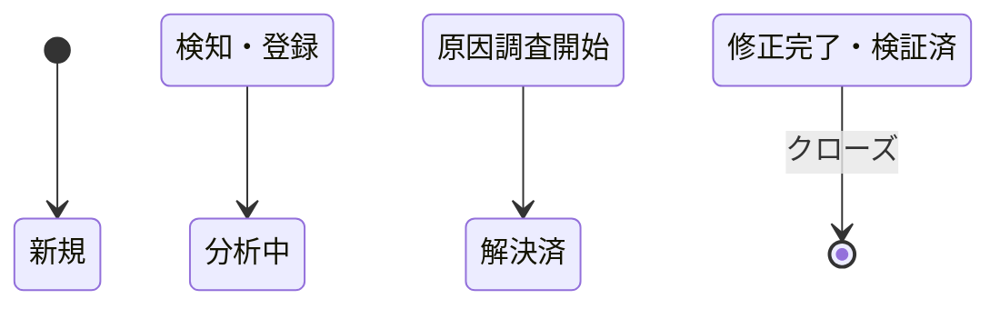

# [MNG-03] 問題管理定義書 (Problem & Issue Management) - horse-racing-game-js

本ドキュメントは、「`horse-racing-game-js`」プロジェクトにおける問題・課題管理の方針、プロセス、および現在検出されている不具合・未実装機能の進捗管理を行うための台帳です。

---

## 1. 問題管理プロセスとライフサイクル (Lifecycle)

バグや機能改善要求などの「問題」は、検知から解決まで以下のライフサイクルに従ってステータスを追跡します。

### 1.1 優先度（Severity）の判定基準
影響度に基づき、問題を以下の3つに分類して対応を行います。
* **High (高)**: ゲームの進行が完全に停止する、またはコアロジックが誤った計算をするなど、プレイ不能になる不具合。
* **Medium (中)**: 主要機能（ベット、データ検証など）の未実装、または仕様の不整合。
* **Low (低)**: 表示のガタつき、コーディング規約の不統一など、代替策が存在する、あるいはゲームプレイ自体への影響が軽微なもの。

---

## 2. 課題・バグ管理台帳 (Issue Ledger)

現在プロジェクトで追跡している課題およびバグの一覧です。詳細な内容はリンク先の各Issueドキュメントを参照してください。

| 課題ID | 優先度 (Severity) | ステータス | 課題概要 | 関連ドキュメント |
| :--- | :--- | :--- | :--- | :--- |
| **[ISSUE-01]** | High | 新規 (New) | プレイカード使い切り時のスタック問題 | [ISSUE-01-playcard_stack_problem.md](issue/ISSUE-01-playcard_stack_problem.md) |
| **[ISSUE-02]** | Medium | 分析中 (Analyzing) | ゲームシステム（対戦・ベット）の本実装 | [ISSUE-02-game_system_implementation.md](issue/ISSUE-02-game_system_implementation.md) |
| **[ISSUE-03]** | Medium | 解決済 (Resolved) | マスターデータの値バリデータ (ValueChecker) の未実装 | [ISSUE-03-masterdata_value_checker.md](issue/ISSUE-03-masterdata_value_checker.md) |
| **[ISSUE-04]** | Low | 解決済 (Resolved) | レンダラーとモデルの密結合 | [ISSUE-04-decoupling_renderer_and_model.md](issue/ISSUE-04-decoupling_renderer_and_model.md) |
| **[ISSUE-05]** | Low | 解決済 (Resolved) | コーディング規約の混在 | [ISSUE-05-coding_standards_mixture.md](issue/ISSUE-05-coding_standards_mixture.md) |
| **[ISSUE-06]** | Low | 解決済 (Resolved) | エンジンラグ処理時の不整合 | [ISSUE-06-engine_lag_inconsistency.md](issue/ISSUE-06-engine_lag_inconsistency.md) |
| **[ISSUE-07]** | Medium | 解決済 (Resolved) | シーン遷移やテスト実行時におけるDOM非存在エラー | [ISSUE-07-dom_null_pointer_exceptions.md](issue/ISSUE-07-dom_null_pointer_exceptions.md) |
| **[ISSUE-08]** | Low | 新規 (New) | テスト実行環境の近代化 | [ISSUE-08-modernizing_test_framework.md](issue/ISSUE-08-modernizing_test_framework.md) |
| **[ISSUE-09]** | Low | 新規 (New) | 起動時データ検証処理の本番実行パスからの分離 | [ISSUE-09-decoupling_bootstrap_validation.md](issue/ISSUE-09-decoupling_bootstrap_validation.md) |
| **[ISSUE-10]** | Low | 解決済 (Resolved) | reportUnknownTypes の警告解消と型定義の厳格化 | [ISSUE-10-strict_type_definitions.md](issue/ISSUE-10-strict_type_definitions.md) |
| **[ISSUE-11]** | Low | 解決済 (Resolved) | 未使用ローカル変数の警告解消 (JSC_UNUSED_LOCAL_ASSIGNMENT) | [ISSUE-11-unused_local_variables.md](issue/ISSUE-11-unused_local_variables.md) |
| **[ISSUE-12]** | Low | 解決済 (Resolved) | モンスター名（出走馬名）の命名不整合 | [ISSUE-12-monster_names_inconsistency.md](issue/ISSUE-12-monster_names_inconsistency.md) |
| **[ISSUE-13]** | Low | 解決済 (Resolved) | Service Locator 徹底による結合度低減 | [ISSUE-13-service_locator_enforcement.md](issue/ISSUE-13-service_locator_enforcement.md) |
| **[ISSUE-14]** | Low | 解決済 (Resolved) | Makefile 内の重複ソースファイルの解消 | [ISSUE-14-makefile_duplicate_sources.md](issue/ISSUE-14-makefile_duplicate_sources.md) |
| **[ISSUE-15]** | Low | 解決済 (Resolved) | テンプレートエンジン内 innerHTML 使用の代替・安全化 | [ISSUE-15-template_innerhtml_usage.md](issue/ISSUE-15-template_innerhtml_usage.md) |
| **[ISSUE-16]** | High | 解決済 (Resolved) | 初期化処理の順序不整合による directors 取得失敗エラー (Cannot read properties of null) | [ISSUE-16-initialization_order_directors_error.md](issue/ISSUE-16-initialization_order_directors_error.md) |

