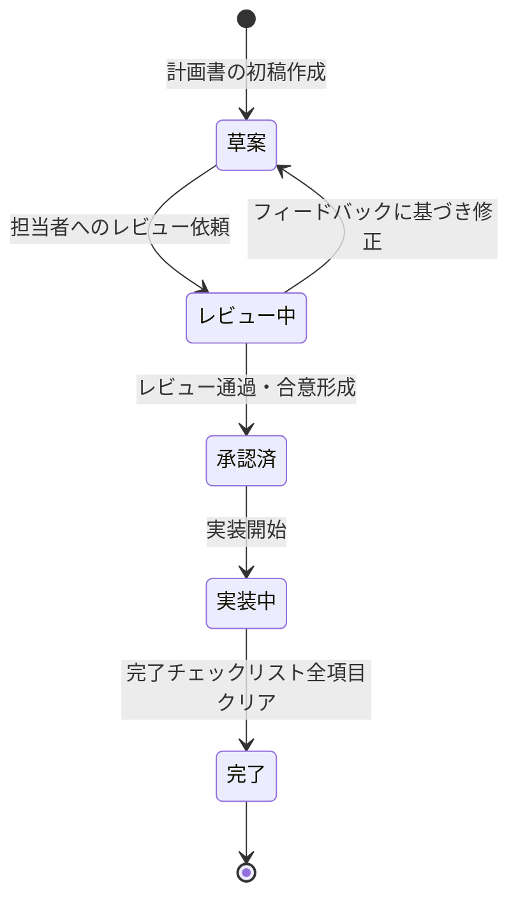

# [MNG-05] 実行計画書フォーマット定義 (ExecPlan Format Definition) - horse-racing-game-js

本ドキュメントは、「`horse-racing-game-js`」における大規模かつ複雑な機能追加・改修を安全に実施するための「実行計画書（ExecPlan）」のフォーマット、作成プロセス、および管理ルールを定義します。

実行計画書は、LLMコーディングエージェント等を活用した開発ワークフローにも対応し、実装開始前の合意形成ツールとして機能します。

---

## 1. 実行計画書（ExecPlan）の概要

### 1.1 目的

| 目的 | 詳細 |
| :--- | :--- |
| **アーキテクチャ崩壊の防止** | 無計画な実装による密結合化・スパゲティコード化を防ぐ |
| **手戻りの最小化** | 実装前に影響範囲・リスクを洗い出し、設計のブレを排除する |
| **合意形成** | 実装者（人間・LLMエージェント）と設計者の間で実装内容を明確に合意する |
| **安全な開発** | 失敗時のリカバリ策を事前に定義し、不可逆な変更のリスクを管理する |

### 1.2 作成が必要なケース

以下のいずれかに該当する場合、実行計画書の作成が**必須**です。

- [ ] 新しいゲームシーンの追加（例: 新レースモード、マルチプレイ対戦）
- [ ] エンジン基盤（`engine.js`, `publisher.js`, `template.js`）への変更
- [ ] 既存のイベントシステム（`ExEvent`）の拡張または置き換え
- [ ] オッズ・カード効果の大幅なバランス変更（複数パラメータの同時変更）
- [ ] 3つ以上のファイルにまたがる設計変更
- [ ] LLMコーディングエージェントを使った自動実装タスク

### 1.3 計画書の配置場所

```
docs/execplan/
└── EXEC-01-<feature-name>.md    # 実行計画書（連番管理）
```

作成後は [MNG-01-document_ledger.md](MNG-01-document_ledger.md) の台帳に追記すること。

---

## 2. 実行計画書テンプレート (ExecPlan Template)

以下のテンプレートをコピーして `docs/execplan/EXEC-XX-<概要>.md` を作成してください。

---

### テンプレート（ここからコピー）

```markdown
# [EXEC-XX] <タスク名> 実行計画書

* **作成日**: YYYY-MM-DD
* **作成者**: <名前 or LLMエージェント名>
* **ステータス**: 草案 (Draft) / レビュー中 (In Review) / 承認済 (Approved) / 完了 (Done)
* **関連Issue/Feature**: [ISSUE-XX] / [FEAT-XXX]

---

## 1. タスク概要

### 1.1 背景・目的
<!-- なぜこの機能追加/変更が必要なのか、現状の何が課題なのかを記述 -->

### 1.2 実装するもの（スコープ）
<!-- 実装対象を箇条書きで明確にする。「XXはスコープ外」も明記する -->

**スコープ内**:
- 

**スコープ外**:
- 

---

## 2. 既存アーキテクチャへの影響分析

### 2.1 変更対象ファイル

| ファイル | 変更種別 | 変更概要 |
| :--- | :--- | :--- |
| `src/js/game/...` | 新規/変更/削除 | ... |

### 2.2 影響範囲（依存関係）

<!-- 変更対象ファイルに依存している他のファイルを列挙する -->
<!-- Pub/Subイベントの変更が伴う場合は、Publisher/Subscriber双方を記載 -->

### 2.3 Closure Compiler への影響

- [ ] 新しい型アノテーションが必要か（`@type`, `@param`, `@return` 等）
- [ ] 新しい `@interface` / `@implements` が必要か
- [ ] `make` によるビルドが影響を受けるか

---

## 3. マイルストーン分解 (Milestones)

大きなタスクを独立して検証可能な小さなマイルストーンに分解します。各マイルストーンは「実装 → テスト」のサイクルで完結できる単位とします。

| マイルストーン | 作業内容 | 完了条件 | 見積もり |
| :--- | :--- | :--- | :--- |
| **M1** | ... | `make test` が全件PASS | Xh |
| **M2** | ... | ... | Xh |
| **M3（統合）** | ... | ブラウザで動作確認 | Xh |

---

## 4. テスト計画

### 4.1 単体テスト

<!-- 追加・変更する単体テストケースを列挙する -->

| テストケース | テスト対象 | 合格基準 |
| :--- | :--- | :--- |
| | | |

### 4.2 統合テスト

<!-- 手動で確認するシナリオを列挙する -->

| シナリオ | 手順 | 期待結果 |
| :--- | :--- | :--- |
| | | |

### 4.3 ゲームバランス確認（該当する場合）

<!-- パラメータ変更がある場合、オートプレイで確認するKPIを記載する -->

---

## 5. リカバリ計画 (Recovery Plan)

### 5.1 失敗シナリオと対処法

| 失敗ケース | 検知方法 | 対処法 |
| :--- | :--- | :--- |
| `make` ビルドエラー | CI/CD ログ | 変更をrevertし、型アノテーションを修正 |
| `make test` のFAIL | テスト出力 | 失敗テストのスタックトレースを確認し、M1から再作業 |
| ゲームがブラウザでクラッシュ | コンソールエラー | `git stash` でロールバックし、原因を特定 |

### 5.2 ロールバック手順

```bash
# 直近のコミットに戻す
git revert HEAD

# または特定のコミットハッシュまで戻す
git reset --hard <commit-hash>
```

---

## 6. 完了チェックリスト

実装完了後、以下の全項目にチェックを入れてからマージすること。

- [ ] `make test` が全件PASSすること
- [ ] `make` でビルドエラーが0件であること
- [ ] ブラウザでタイトル〜レース〜リザルトの一連フローが正常動作すること
- [ ] CHANGELOG.md に変更内容を記録したこと
- [ ] 影響を受けたドキュメント（REQ/DSN等）を更新したこと
- [ ] 必要に応じてADRを追加したこと
- [ ] 本実行計画書のステータスを「完了 (Done)」に更新したこと
```

---

## 3. 実行計画書の管理プロセス

### 3.1 ライフサイクル



### 3.2 LLMコーディングエージェントとの連携

実行計画書はLLMエージェントが自律的に実装タスクを進める際の「設計書」として機能します。

**エージェントへの指示例**:
```
[EXEC-01] に従って実装を開始してください。
M1（基盤設計）から順番に進め、各マイルストーン完了時に
`make test` の結果を報告してから次のマイルストーンに進んでください。
計画書のスコープ外の変更を行う場合は、必ず事前に確認を求めてください。
```

> [!IMPORTANT]
> LLMエージェントは実行計画書の**スコープ外の変更**を独断で行ってはいけません。スコープ外の変更が必要な場合は、計画書を更新してレビューを受けてから実施してください。

---

## 4. 実行計画書台帳 (ExecPlan Ledger)

現在プロジェクトで定義・管理されている実行計画書の一覧です。

| 計画書ID | タスク名 | ステータス | 関連Issue | 作成日 |
| :--- | :--- | :--- | :--- | :--- |
| （計画書が作成された際にここに追記してください） | | | | |

---

## 5. 関連ドキュメント

| ドキュメント | 関連内容 |
| :--- | :--- |
| [MNG-01-document_ledger.md](MNG-01-document_ledger.md) | ドキュメント台帳（ExecPlanの追加時に更新） |
| [MNG-02-development_process.md](MNG-02-development_process.md) | ADRプロセス・設計方針 |
| [MNG-03-problem_management.md](MNG-03-problem_management.md) | 関連Issue・バグ管理 |
| [MNG-04-test_plan.md](MNG-04-test_plan.md) | テスト戦略（テスト計画の策定に活用） |
| [DSN-01-high_level_design.md](DSN-01-high_level_design.md) | システム全体アーキテクチャ（影響分析に活用） |
| [GDD-01-game_design_document.md](GDD-01-game_design_document.md) | ゲームビジョン（スコープ判断の基準） |
