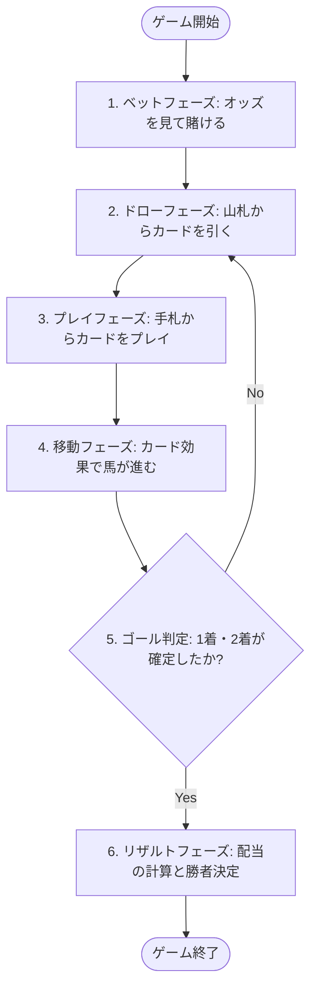
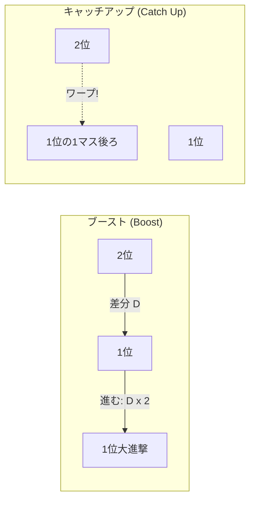

# [USR-01] 公式ルールブックおよび操作マニュアル (Game Rulebook & User Manual) - horse-racing-game-js

本ドキュメントは、「`horse-racing-game-js`」の公式ルールブックおよび操作マニュアルです。プレイヤーがゲームの全体像、勝利条件、賭け（ベット）システム、および各種カードの効果と戦略的駆け引きを理解し、プレイできるように構成されています。

---

## 🎮 1. ゲーム概要

「`horse-racing-game-js`」は、5頭の魅力的なモンスターフィギュア（出走馬）が全長 **70マス** の特設コースを駆け抜ける、投資と戦略のシミュレーション・ボードゲームです。

プレイヤーは、レース展開を予測して「どの2頭が1着・2着になるか」を予想してコインを賭け（ベット）、手札からさまざまな効果を持つ「プレイカード」を駆使して、自分が賭けた馬を有利にゴールへと導きます。

---

## 🏇 2. 出走モンスター（フィギュア）紹介

レースに参加するモンスターは全部で5体。それぞれ独自のカラーとテーマを持っています。

| 馬番 (ID) | モンスター名 (種族) | テーマカラー | HTMLカラーコード | 特徴・イメージ |
| :---: | :--- | :---: | :---: | :--- |
| **1** | **サラマンダー (Salamander / Red)** | レッド | `#FF0000` | 王道の赤。爆発的なスピードを持つ |
| **2** | **フェニックス (Phoenix / Orange)** | オレンジ | `#FFA500` | 狡猾な橙。安定した走りが魅力 |
| **3** | **グリフィン (Griffin / Green)** | グリーン | `#008000` | 軽快な緑。小回りの利くトリッキーな動き |
| **4** | **ケルピー (Kelpie / Blue)** | ブルー | `#0000FF` | 重厚な青。一歩一歩が力強い大器晩成型 |
| **5** | **ワイバーン (Wyvern / Purple)** | パープル | `#800080` | 神秘の紫。予測不能なダッシュを秘める |

---

## 💰 3. ベット（賭け）とオッズシステム

本ゲームは **「馬連（うまれん / Quinella）」** 方式を採用しています。1着と2着に入る組み合わせを、着順に関係なく（順不同で）予想します。

### 3.1 オッズテーブル（配当倍率）
組み合わせの難易度や馬の特性に合わせて、あらかじめ以下のオッズ（配当率）が設定されています。

| 組み合わせ (順不同) | オッズ (倍率) | 組み合わせ (順不同) | オッズ (倍率) |
| :---: | :---: | :---: | :---: |
| **1 - 2** (赤 - 橙) | **5倍** | **2 - 4** (橙 - 青) | **11倍** |
| **1 - 3** (赤 - 緑) | **7倍** | **2 - 5** (橙 - 紫) | **15倍** |
| **1 - 4** (赤 - 青) | **10倍** | **3 - 4** (緑 - 青) | **13倍** |
| **1 - 5** (赤 - 紫) | **14倍** | **3 - 5** (緑 - 紫) | **17倍** |
| **2 - 3** (橙 - 緑) | **8倍** | **4 - 5** (青 - 紫) | **20倍** |

> [!NOTE]
> **配当計算の例**:  
> あなたが「4 - 5（ケルピーとワイバーン）」の組み合わせに **10コイン** をベットし、レース結果が 1着ワイバーン・2着ケルピー（または1着ケルピー・2着ワイバーン）だった場合、オッズは **20倍** となり、**200コイン** の配当を獲得します。

---

## 🃏 4. プレイカード（手札）ルール

ゲームの山札には合計 **60枚** のプレイカードが含まれています。カードは大きく分けて **3つのカテゴリ** に分類され、それぞれ異なるルールで馬を前進させます。

### ① ステップカード (Step Card) — 計45枚
特定の馬（モンスター）をダイレクトに指定し、固定値分だけ前進させるカードです。

* **サラマンダー (Red) 専用**: `+5` / `+9` / `+10`
* **フェニックス (Orange) 専用**: `+5` / `+6` / `+8`
* **グリフィン (Green) 専用**: `+4` / `+5` / `+7`
* **ケルピー (Blue) 専用**: `+4` / `+5` / `+6`
* **ワイバーン (Purple) 専用**: `+3` / `+4` / `+5`

### ② 順位カード (Rank Card) — 計13枚
現在の順位を指定して、その順位に位置する馬を前進させます。

* **1位を前進**: `+5` / `+10` / `+15`
* **2位を前進**: `+5` / `+10` / `+15`
* **3位を前進**: `+5` / `+10` / `+15`
* **4位を前進**: `+5` / `+10` / `+15`
* **最下位 (Last) を前進**: `+35` （一発逆転の超強力カード）

> [!IMPORTANT]
> **【重要】同着時の無効ルール**  
> 指定された順位に **同着（同じマス）の馬が2頭以上存在する場合、カードの効果は完全に無効（前進なし）** になります。  
> 例：「2位を+10前進」をプレイした際、現在2位の位置にグリフィンとケルピーが並んでいた場合、どちらも進むことはできません。単独順位のときのみ効果が適用されます。

### ③ ダッシュカード (Dash Card) — 計2枚 (各1枚)
特殊な移動ロジックを持つ2枚の限定カードです。

#### 1. ブースト (Boost) — 1位強化カード
* **対象**: 単独1位の馬
* **効果**: 1位と2位の馬の「現在の差分マスの2倍」の歩数だけ、1位の馬をさらに突き放すように前進させます。
* **計算式**: $\text{進む歩数} = (\text{1位の座標} - \text{2位の座標}) \times 2$

#### 2. キャッチアップ (Catch Up) — 2位大追撃カード
* **対象**: 単独2位の馬
* **効果**: 2位の馬を一瞬にして「1位の馬のちょうど1マス後ろ」までワープさせるように猛追させます。
* **計算式**: $\text{進む歩数} = (\text{1位の座標} - 1) - \text{2位の座標}$

---

## 🏁 5. 操作マニュアルおよび機能解説

### 5.1 画面構成と操作
1. **タイトル画面**:
   * アプリ起動時に表示される画面。スタートボタンを押下してレース画面へ遷移します。
2. **レース画面**:
   * 画面中央部に5つのレーン（出走馬の位置）が表示されます。
   * 画面右下に山札と手札が表示されます（デバッグモードでは、山札から自動的にカードがドローされ、実行されます）。
   * 画面上部のメニューバーには、**「最初から（Reset）」** ボタンおよびデバッグ用の **「一手戻す（Undo）」** ボタン、自動実行用の **「Auto Play」** トグルが配置されています。
3. **結果表示画面**:
   * いずれか2頭がゴールライン（70マス）を超えた時点で自動遷移します。
   * 着順と、ベットに基づいたオッズ配当結果が表示されます。

### 5.2 操作のヒントと戦略
* **最下位カード（+35）の活用**: 最下位の馬を一気に先頭集団へ引き上げることができます。自分が賭けた馬をあえて序盤最下位に停滞させ、このカードで一気に逆転を狙う戦術が有効です。
* **同着ブロック**: 相手が進めたい順位の馬に対して、意図的に別の馬を同着に並ばせることで、相手がプレイする「順位カード」の効果を不発に終わらせるディフェンスが可能です。
