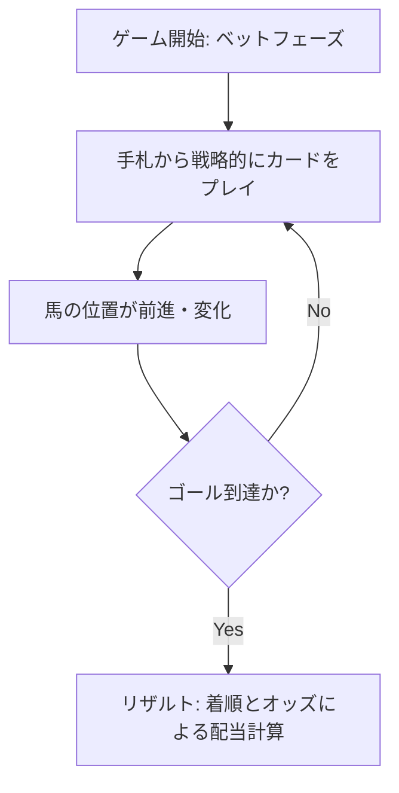

# 🏇 horse-racing-game-js ハイレベル設計書 (High-Level Design)

本ドキュメントは、バニラJavaScriptで構築されたブラウザベースの競馬ボードゲーム「`horse-racing-game-js`」のビジネス視点およびシステム大枠の設計をまとめたものです。経営層や非エンジニアのステークホルダー向けに、システムの価値と構造を平易に解説します。

---

## 1. プロジェクト概要とビジネスバリュー

本プロジェクトは、カードとオッズを駆使して競う戦略性の高い「競馬ボードゲーム」をデジタル化し、ウェブブラウザで手軽にプレイできる環境を提供するものです。

### 💡 ビジネス上の強みと導入効果
1. **フレームワーク非依存（バニラJS）による超軽量動作**
   * ReactやVueといった特定のフロントエンドフレームワークを一切使用せず、純粋なJavaScriptのみで構築しています。
   * ファイルサイズが極めて小さく（メインコードで150KB未満）、スマートフォンの低速回線や古いブラウザでも遅延なく瞬時に起動します。
2. **高い拡張性と移植性**
   * 独自のモジュール化設計を採用しているため、将来的にスマートフォンアプリ（iOS / Android）への移植や、オンライン対戦サーバーとの連携が容易に行えます。
3. **再現可能なフェアプレイ環境**
   * ゲーム内の「ランダム要素」を完全にコントロールできる仕組みを導入しています。これにより、ユーザー間対戦での不正防止や、ゲーム展開の完全な再現（リプレイ機能など）が容易になり、Eスポーツ的な展開やデバッグ効率の劇的な向上が見込めます。

---

## 2. ゲームコンセプトと基本ルール

プレイヤーは自分の所有する馬（モンスターフィギュア）を進め、1着・2着でのゴールを目指します。



### 🎲 主要なゲーム要素
* **プレイカードによる駆け引き**:
  単に運だけで進むのではなく、特定の馬を確実に進める「ステップカード」、現在の順位（例：2位の馬）を狙い撃ちして進める「順位カード」、劇的な逆転を狙う「ダッシュカード」を手札から選択してプレイします。
* **オッズとベットシステム**:
  レース開始前に各組み合わせの「配当率（オッズ）」を確認し、どの組み合わせに賭けるか（ベット）を判断する、投資シミュレーション的な楽しさも内包しています。

---

## 3. 全体システムアーキテクチャ (High-Level Architecture)

システムは、機能ごとに明確に役割を分離した「疎結合（独立性が高い）設計」を採用しています。これにより、一部分の変更が全体に悪影響を及ぼさない安定したシステムを実現しています。

```mermaid
graph LR
    subgraph ユーザーインターフェース (見た目)
        UI[画面表示・操作レイヤー]
        TE[テンプレートエンジン]
    end
    
    subgraph コア・ゲームロジック (仕組み)
        GE[ゲームエンジン]
        Rules[ゲームルール・判定]
        DM[データ管理・保存]
    end

    UI <-->|Pub/Sub イベント通信| GE
    TE --> UI
    GE --> Rules
    GE --> DM
```

### 🏢 主要コンポーネントの役割
1. **ゲームエンジン (コア)**
   * ゲームの「時間」と「進行」を一定ペースで管理します。ブラウザのタブがバックグラウンドに回った際のラグ解消など、快適なプレイ環境を維持する制御を行います。
2. **イベント通信システム**
   * 「画面の描画」と「ゲームの計算（ロジック）」を直接繋がず、メッセンジャー（イベント）を介して通信させます。これにより、将来「グラフィックを3Dにアップグレードする」「通信対戦にする」といった変更が生じた際も、計算ロジック側を一切書き換えることなく対応が可能です。
3. **動的画面描画 (テンプレートエンジン)**
   * 軽量な画面描画システムを内蔵しており、データ（馬の位置やオッズなど）の変動に合わせて、画面をスムーズかつ最小限の処理で書き換えます。

---

## 4. 今後のビジネス展開ロードマップ

現在の基盤設計を活かし、以下の段階的リリースおよび事業価値の向上を目指します。

* **フェーズ 1: コアバグの解消とルール完成**
  * ゲームが途中でスタックする既知の仕様バグを修正し、スタンドアロンでの一人プレイ仕様を完璧に仕上げます。
* **フェーズ 2: プレイヤー対戦（マルチプレイ）機能の実装**
  * 同一端末での複数人対戦、手札の非公開配布、ベットコインのやり取りなどのゲームプレイの本実装を行います。
* **フェーズ 3: オンライン化とプラットフォーム展開**
  * サーバーサイドのデータ連携を導入し、オンラインマルチプレイヤー対戦、ランキングシステム、各モバイルアプリストアへのアプリ配信を展開します。
