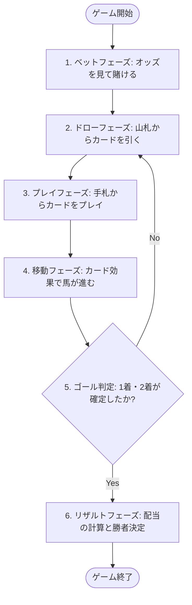

# 🏇 horse-racing-game-js 公式ルールブック (Game Rulebook)

本ドキュメントは、バニラJavaScriptで構築されたブラウザベースの競馬ボードゲーム「`horse-racing-game-js`」の公式ルールブックです。
プレイヤーがゲームの全体像、勝利条件、賭け（ベット）システム、およびカードの効果と戦略的駆け引きを完全に理解できるように構成されています。

---

## 🎮 1. ゲーム概要

「`horse-racing-game-js`」は、5体の魅力的なモンスターフィギュア（出走馬）が全長 **70マス** の特設コースを駆け抜ける、投資と戦略のシミュレーション・ボードゲームです。

プレイヤーは単に特定の馬を応援するだけでなく、レース展開を予測して「どの2頭が1着・2着になるか」を予想してコインを賭け（ベット）、手札からさまざまな効果を持つ「プレイカード」を駆使して、自分が賭けた馬を有利にゴールへと導きます。



---

## 🏇 2. 出走モンスター（フィギュア）紹介

レースに参加するモンスターは全部で5体。それぞれ独自のカラーと象徴的な種族を持っています。

| 馬番 (ID) | モンスター名 (種族) | テーマカラー | HTMLカラーコード | 特徴・イメージ |
| :---: | :--- | :---: | :---: | :--- |
| **1** | **ドラゴン (Dragon / Red)** | レッド | `#FF0000` | 王道の赤。爆発的なスピードを持つ |
| **2** | **デーモン (Daemon / Orange)** | オレンジ | `#FFA500` | 狡猾な橙。安定した走りが魅力 |
| **3** | **ドラキー (Drakee / Green)** | グリーン | `#008000` | 軽快な緑。小回りの利くトリッキーな動き |
| **4** | **ゴーレム (Golem / Blue)** | ブルー | `#0000FF` | 重厚な青。一歩一歩が力強い大器晩成型 |
| **5** | **ゴースト (Ghost / Purple)** | パープル | `#800080` | 神秘の紫。予測不能なダッシュを秘める |

---

## 💰 3. ベット（賭け）とオッズシステム

本ゲームは **「馬連（うまれん / Quinella）」** 方式を採用しています。
1着と2着に入る組み合わせを、着順に関係なく（順不同で）予想します。

### 📊 オッズテーブル（配当倍率）
組み合わせの難易度や馬の特性に合わせて、あらかじめ以下のオッズ（配当率）が設定されています。
馬番の「若い組み合わせ」ほど本命視されてオッズが低く、「遅い組み合わせ」ほど大穴となり高配当が期待できます。

| 組み合わせ (順不同) | オッズ (倍率) | 組み合わせ (順不同) | オッズ (倍率) |
| :---: | :---: | :---: | :---: |
| **1 - 2** (赤 - 橙) | **5倍** | **2 - 4** (橙 - 青) | **11倍** |
| **1 - 3** (赤 - 緑) | **7倍** | **2 - 5** (橙 - 紫) | **15倍** |
| **1 - 4** (赤 - 青) | **10倍** | **3 - 4** (緑 - 青) | **13倍** |
| **1 - 5** (赤 - 紫) | **14倍** | **3 - 5** (緑 - 紫) | **17倍** |
| **2 - 3** (橙 - 緑) | **8倍** | **4 - 5** (青 - 紫) | **20倍** |

> [!NOTE]
> **配当計算の例**:  
> あなたが「4 - 5（ゴーレムとゴースト）」の組み合わせに **10コイン** をベットし、レース結果が 1着ゴースト・2着ゴーレム（または1着ゴーレム・2着ゴースト）だった場合、オッズは **20倍** となり、**200コイン** の配当を獲得します！

---

## 🃏 4. プレイカード（手札）ルール

ゲームの山札には合計 **60枚** のプレイカードが含まれています。カードは大きく分けて **3つのカテゴリ** に分類され、それぞれ異なるルールで馬を前進させます。

### ① ステップカード (Step Card) — 計45枚 (15種 × 各3枚)
特定の馬（モンスター）をダイレクトに指定し、固定値分だけ前進させるカードです。最も確実な移動手段です。

* **ドラゴン (Red) 専用**: `+5` / `+9` / `+10`
* **デーモン (Orange) 専用**: `+5` / `+6` / `+8`
* **ドラキー (Green) 専用**: `+4` / `+5` / `+7`
* **ゴーレム (Blue) 専用**: `+4` / `+5` / `+6`
* **ゴースト (Purple) 専用**: `+3` / `+4` / `+5`

---

### ② 順位カード (Rank Card) — 計13枚 (各1枚)
「現在の順位」を指定して、その順位に位置する馬を前進させる戦略性の高いカードです。

* **1位を前進**: `+5` / `+10` / `+15`
* **2位を前進**: `+5` / `+10` / `+15`
* **3位を前進**: `+5` / `+10` / `+15`
* **4位を前進**: `+5` / `+10` / `+15`
* **最下位 (Last) を前進**: `+35` （一発逆転の超強力カード！）

> [!IMPORTANT]
> **【超重要】同着（タイ）時の無効ルール**  
> 指定された順位に **同着（同じマス）の馬が2頭以上存在する場合、カードの効果は完全に無効（前進なし）** になります。  
> 例：「2位を+10前進」をプレイした際、現在2位の位置にドラキーとゴーレムが並んでいた場合、どちらも進むことはできません（効果対象外となります）。単独順位のときのみ効果が適用されます。

---

### ③ ダッシュカード (Dash Card) — 計2枚 (各1枚)
レースの展開を劇的に変化させる、特殊な移動ロジックを持つ2枚の限定カードです。

#### 1. ブースト (Boost / ID: 1) — 1位強化カード
* **対象**: 単独1位の馬
* **効果**: 1位と2位の馬の「現在の差分マスの2倍」の歩数だけ、1位の馬をさらに突き放すように前進させます。
* **計算式**:  
  $$\text{進む歩数} = (\text{1位の座標} - \text{2位の座標}) \times 2$$
  *(例：1位が座標40、2位が座標35にいる場合、 $(40 - 35) \times 2 = 10$ マス前進)*
* **発動条件**: 1位および2位の馬がそれぞれ単独（同着がいない）である必要があります。

#### 2. キャッチアップ (Catch Up / ID: 2) — 2位大追撃カード
* **対象**: 単独2位の馬
* **効果**: 2位の馬を一瞬にして「1位の馬のちょうど1マス後ろ」までワープさせるように猛追させます。
* **計算式**:  
  $$\text{進む歩数} = (\text{1位の座標} - 1) - \text{2位の座標}$$
  *(例：1位が座標50、2位が座標30にいる場合、 $(50 - 1) - 30 = 19$ マス一気に前進)*
* **発動条件**: 1位および2位の馬がそれぞれ単独（同着がいない）である必要があります。

```mermaid
graph LR
    subgraph ブースト Boost
        B1[2位] -- 差分 D -- > B2[1位]
        B2 -- 進む: D x 2 --> B3[1位大進撃]
    end
    
    subgraph キャッチアップ Catch Up
        C1[2位] -. ワープ! .-> C2[1位の1マス後ろ]
        C3[1位]
    end
```

---

## 🏁 5. レース進行とゴール・勝利条件

### 🔄 ゲームの流れ
1. **ベットフェーズ**: 
   プレイヤーはオッズ表を確認し、コインを賭ける組み合わせ（馬連）を選択します。
2. **レーススタート**: 
   すべての馬はスタートゲート（座標0）に配置されます。山札（60枚）がシャッフルされ、ゲームが開始します。
3. **プレイヤーのターン**: 
   * 山札からカードを引きます。
   * 手札からカードを1枚選択してプレイします。
   * カードの効果が計算され、対象の馬が前進します。
   * *※デバッグモードでは、Undo（一手戻す）機能を使って直前のカード効果を取り消し、展開をやり直すことも可能です。*

### 🏆 ゴールと着順判定
* コースの全長は **70マス** です。馬の座標が **70を超えた（71以上になった）** 時点で、その馬はゴールインと判定されます。
* **1着の決定**: 最初に座標が70を超えた馬が「1着」となります。
* **2着の決定**: 2番目に座標が70を超えた馬が「2着」となります。
* **レースの終了**: 1着と2着の馬が確定した瞬間、レースは即時終了します（3位以下の着順は決定されません）。

> [!TIP]
> **戦略的ヒント (戦術論)**:  
> * **最下位カード（+35）の活用**: 最下位の馬を一気に先頭集団へ引き上げることができます。自分が賭けた大穴の馬をわざと最下位に停滞させ、このカードで一気に逆転を狙う戦術が有効です。
> * **同着ブロック**: 相手が進めたい順位の馬に対して、意図的に別の馬を同着に並ばせることで、強力な「順位カード」の効果を不発に終わらせるディフェンスが可能です。

---

以上が「`horse-racing-game-js`」の基本ルールです。カードの引きと正確な位置計算、そしてオッズを見極めたベット戦略を駆使して、栄光の完全的中を目指しましょう！🏇✨
